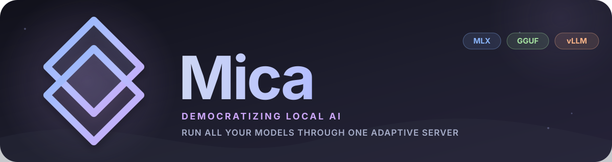

<p align="center">
  
</p>

# Mica Server

Mica is a small local AI server, proxy, and memory-aware model load balancer.
Choose a **workload**—the collection of models you need for a task—and Mica
resolves compatible engines, installs dependencies, downloads artifacts, and
loads or swaps models behind one authenticated API.

Switch between an assistant, coding, transcription, or visual-analysis workload
without deleting cached models. Compatible model workers are retained during
hot-swaps; only workers whose configuration changes need to reload.

> [!WARNING]
> **Alpha: active deslopification and ongoing tests.** Engine integrations,
> configuration, and APIs may change. Hardware compatibility is not inference
> certification, and memory reservations are estimates, not a universal hard
> RSS/VRAM cap. Do not expose Mica directly to an untrusted network.

## Start with the terminal interface

After [installing Mica](docs/getting-started.md), run:

```sh
mica-server tui
```

| View | What you can do |
| --- | --- |
| **Server** | See status, active/default workload, loaded model names and stored data. Choose a workload to start or hot-swap; stop the server. Inspect hardware and resource limits in **Machine**. |
| **Workloads** | Browse curated collections, check compatibility and installation, install/start/swap, edit or clone YAML, and open their models. |
| **Models** | Filter LLM, VLM, ASR, TTS, embeddings and other categories. Inspect modalities, abilities, context, quantizations, cache status, projectors/drafters, and supported engines. |
| **Engines** | Inspect compatible runtimes, installed files, build recipes, and endpoint contracts. |
| **Endpoints** | Read the registered API routes, descriptions, authentication requirements and example calls. |
| **Settings** | Set address, port, default workload, RAM/VRAM allocations and a private API-key file, or rotate the key. |

Use **1–6** to select a view, **Tab** to switch focus, **↑/↓** to select,
**Enter** to explore, and **Esc** to go back. **g** cycles model categories;
**u** reveals hardware-incompatible entries. Changes require confirmation.
Closing the TUI leaves the server running.

The normal lists show hardware-compatible entries. Hidden legacy examples do
not crowd the workload list; your active/default workload and locally installed
YAML definitions remain accessible. Cached, installed, compatible and
memory-eligible are separate states. See the [TUI guide](docs/tui.md).

## How configuration fits together

```text
Discover hardware ───► state/hardware.yaml
                              │
User allocations ────► config/machine.yaml
                              │
                              ▼
Engine manifests ───► compatible install/build/launch recipes
                              │
Model manifests ────► modalities, abilities, context + artifact bundles
                              │
Workload YAML ──────► model selections + optional engine/artifact pins
                      context, KV cache, placement and residency
                              │
                              ▼
                       Mica server
                  admit · load · route · swap
                              │
                              ▼
                    resident engine workers
```

Models declare the engines and artifacts that can run them. Workloads can pin
a particular choice or let Mica select an installed compatible engine, then
fall back to the model's manifest order. Projectors, codecs and drafters belong
to artifact bundles; runtime/context/residency choices belong to workloads.
Machine policy is the global allocation. A workload's memory requirement must
fit it; its optional memory limit cannot exceed it.

The same workload can use `all`, `sequential`, or `balanced` residency when its
budget and model policies permit. Inspect estimates before loading: component
sizes and KV-cache estimates are not measurements of peak process memory.
[Configuration contract](docs/design/configuration-contract.md) ·
[Workload design](docs/profiles.md) · [Memory planning](docs/memory-estimation.md)

## Terminal commands and chat

```sh
mica-server workload list
mica-server workload install WORKLOAD_ID --ram-gib 16
mica-server start --workload WORKLOAD_ID
mica-server status
mica-server workload activate OTHER_PREPARED_WORKLOAD_ID
mica-server endpoints
mica-server stop
```

Use IDs shown in the TUI or workload list. Installs prepare engines and models;
activation requires a prepared workload and does not install missing engines
inside a running server. Configure `--host 0.0.0.0` for a trusted LAN; localhost
is the default. API keys stay hidden in the TUI.

The included [browser chat](docs/getting-started.md#run-the-server) supports
streamed replies, media attachments, voice when the workload supports it,
workload selection, settings, and session import/export. It is a client of Mica,
not a required part of the server.

## Small native control plane

C++20 and embedded Lua implement the CLI, TUI, hardware discovery and scheduling.
A native GGUF-only workload does not need Python for serving. MLX and vLLM use
Python only for their engines; optional browser tooling and offline development
tools can also use it. Engines and weight downloads are separate from the core
binary. Everything lives under `~/.mica` by default (`MICA_HOME` or `--root`
overrides it).

## Documentation

- [Install and run](docs/getting-started.md), including source builds and Linux GPU setup
- [TUI walkthrough](docs/tui.md)
- [Workloads](docs/profiles.md) and [engines/artifacts](docs/engines-and-profiles.md)
- [API reference](docs/api.md) and [schema vocabulary](docs/schema-vocabulary.md)
- [Models and quantization](docs/models.md), [model cards](docs/model-cards/)
- [Memory estimation](docs/memory-estimation.md) and [measured profiling](docs/model-memory-profiling.md)
- [Validation evidence](docs/validation/), [researcher checks](docs/researcher-validation.md)
- [Development](docs/development.md), [vLLM certification](docs/vllm-quantization.md)

## Roadmap

- [ ] Complete vLLM certification on native CUDA/ROCm/XPU hardware.
- [ ] Add image-generation and music/audio-generation engines and artifacts.
- [ ] Expand hardware-specific inference, concurrency and memory testing.

## License

[GPL-3.0](LICENSE). Model artifacts retain their own licenses; consult their
model cards before redistribution or commercial use.
