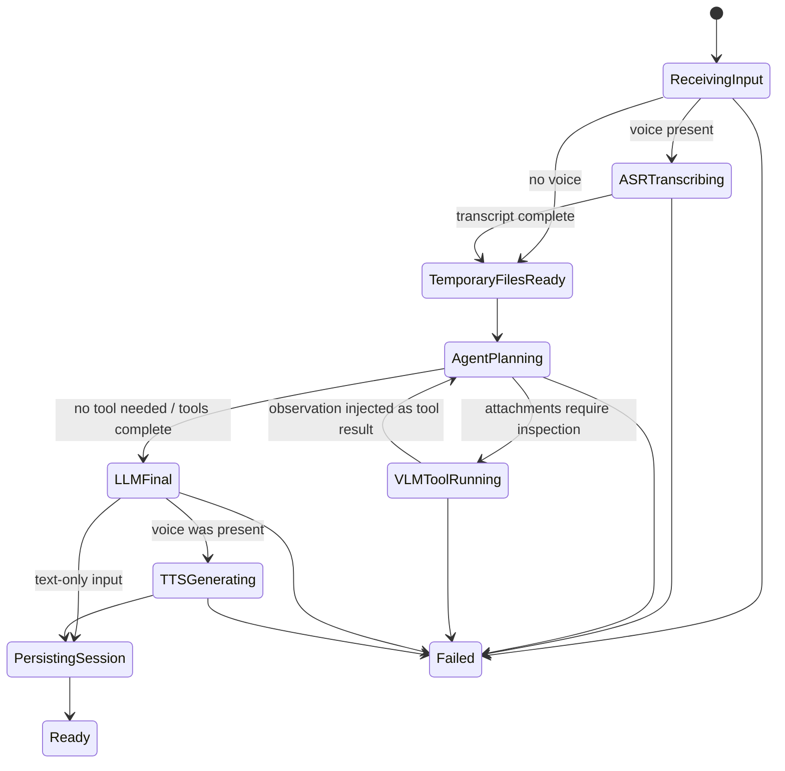

# Unified agent chat state machine

Status: implemented prototype on the MLX path  
Last updated: 2026-09-18

The chat has one main reasoning model. ASR, VLM, and TTS are utilities used by
that model; they are not separate conversations. A session persists messages,
uploaded paths, attachment counts, tool calls, tool observations, generated
audio paths, and state history in temporary JSON so a later turn can continue
the same task.



## Input resolution

| Supplied input | Main instruction | Supporting context | Reply |
| --- | --- | --- | --- |
| Text only | Typed text | Attachments, when present | Text |
| Voice only | ASR transcript | Attachments, when present | Text and audio |
| Text and voice | Typed text | ASR transcript plus attachments | Text and audio |
| Attachments only | Inspect and summarize | Attachment manifest | Text |

Uploaded files are copied beneath the session directory. The LLM sees only
proxy-created paths and media counts. The VLM tool rejects any path not in that
turn's exact allowlist. Images go directly to MiniCPM-V; videos use its video
input; PDFs are rendered into bounded page images before inference. The browser
renders supported text documents into page images before upload.

Current configured tool limits are loaded from `config/tools.lua`: eight images,
one video, eight document pages, 32 sampled video frames, eight total visual
items, four agent steps, and 50 MiB combined upload size.

## API modes

`POST /v1/agent/chat` accepts multipart form data and returns one final JSON
object. It calls the standard chat-completion, transcription, and speech routes
with streaming disabled.

`POST /v1/agent/chat/stream` accepts the same fields and returns
`text/event-stream`. Its event contract is:

| Event | Payload | Source |
| --- | --- | --- |
| `state` | Current state | Mica state machine |
| `transcript_delta` | Incremental transcription text | MLX Audio NDJSON ASR stream |
| `transcript_end` | Complete transcript | Mica ASR adapter |
| `attachments` | Bounded path/count manifest | Mica upload boundary |
| `tool_call` | Validated VLM call | Spark native tool call |
| `tool_result` | Media observation and counts | MiniCPM-V completion |
| `text_delta` | Incremental answer text | Spark chat-completion SSE stream |
| `text_end` | Complete answer | Mica LLM adapter |
| `audio_chunk` | Sequence number and base64 standalone WAV | Audio8 speech endpoint |
| `audio_end` | Chunk count | Mica TTS adapter |
| `done` | Same final metadata as non-stream mode | Mica session store |
| `error` | In-band terminal error | Mica boundary |

Audio8's current MLX `arktts` implementation generates a whole utterance per
call even when its server transport has `stream=true`. Mica therefore sends
bounded sentence segments to the native speech endpoint and emits each returned
standalone WAV immediately. This is progressive sentence audio, not
frame-by-frame Audio8 decoding. Models with native chunked generation are
forwarded chunk-for-chunk through the same contract.

The local browser proxy relays SSE without buffering. The chat UI decodes each
WAV chunk and schedules it after the prior chunk. With stream mode off, it waits
for the final JSON and uses the ordinary WAV response.

## Temporary layout

```text
<mica-root>/mica-server/tmp/sessions/<session-id>/
├── session.json
├── uploads/
├── rendered/
└── audio/
```

This is recoverable session context, not a permanent knowledge store. A future
cleanup policy must remove idle sessions only when no request is in flight.

## Known prototype boundaries

- The current lock is global across agent sessions; replace it with per-session
  locking before concurrent production use.
- Browser microphone audio is uploaded after recording stops. ASR model output
  then streams token-by-token; continuous microphone/WebSocket ingestion is a
  separate realtime transport.
- Office documents are not parsed natively. The browser handles supported text
  files, and the native API accepts PDF for document rendering.
- The stream endpoint is implemented for the unified agent path. Generic public
  proxy routes still need transparent worker-stream forwarding.
